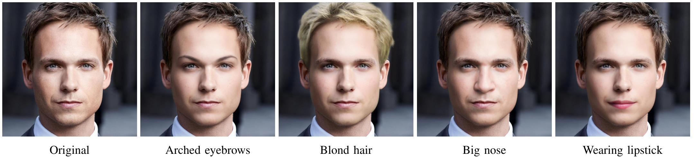

# High Resolution Face Editing with Masked GAN Latent Code Optimization

[Paper](https://arxiv.org/abs/2103.11135)

We propose a method for high resolution face editing through the use of constraints on GAN inpainted image regions.

## Setup

### 1. Install requirements
pip install -r requirements.txt

### 2. Download pretrained models

#### StyleGAN2
Convert the official weights, by cloning and following instructions of 
[rosinality's PyTorch StyleGAN implementation ](https://github.com/rosinality/stylegan2-pytorch).
Copy the created `stylegan2-ffhq-config-f.pt` checkpoint to models/stylegan2 folder.

#### Other models (attribute classifier, face parser and e4e encoder)
Download the model checkpoint with download.sh script

`./download.sh`

#### 3. Run the program
`python main.py --attribute mouth_slightly_open --outdir output --image input/1815.jpg`

You can also optionally use the e4e model (it is downloaded via `download.sh` script). Use it by specifying 
`--use_e4e` argument when calling the `main.py` script.

The available attributes are specified in config.yml 

### Acknowledgement
StyleGAN2 code is based on [rosinality's PyTorch implementation](https://github.com/rosinality/stylegan2-pytorch).

The e4e code is based on the [official implementation](https://github.com/omertov/encoder4editing)
