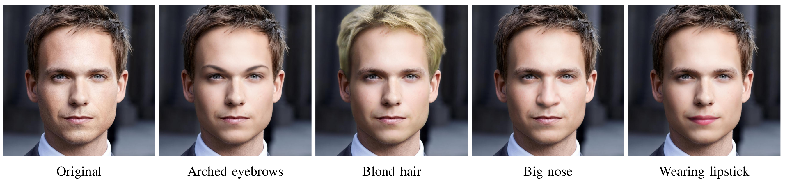
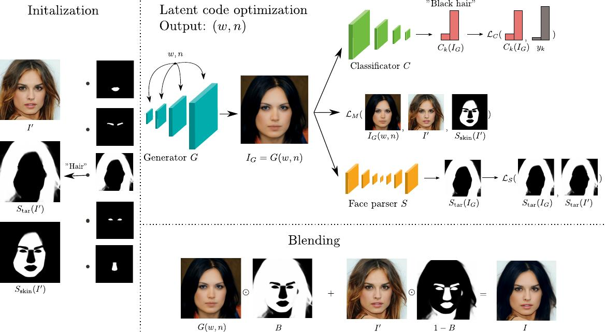
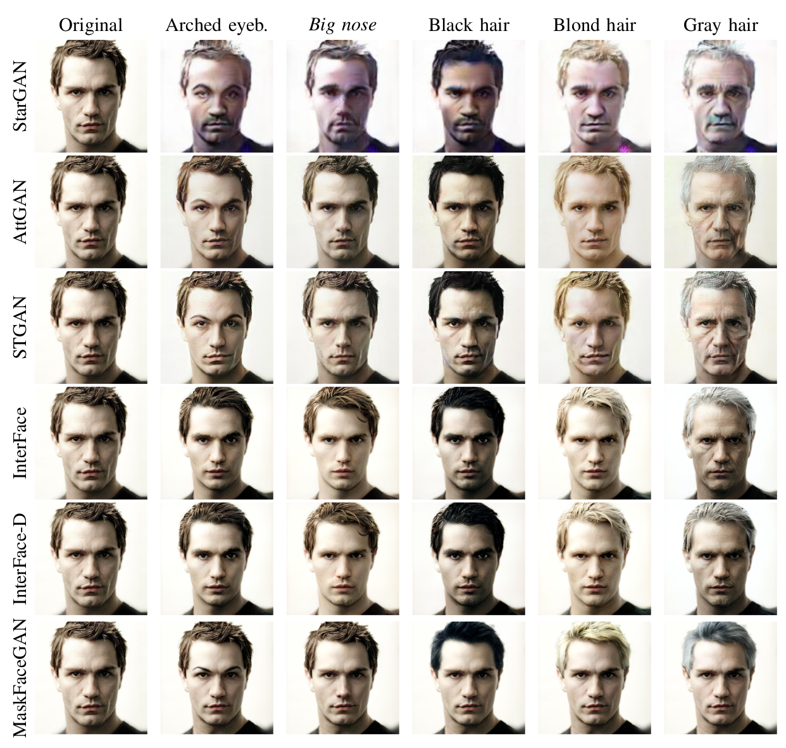
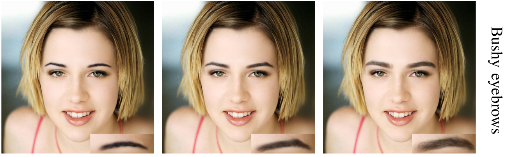
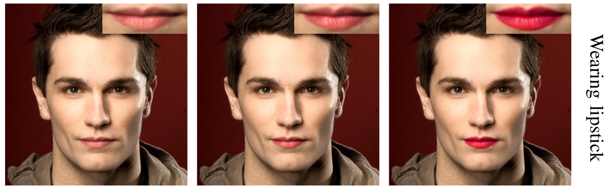
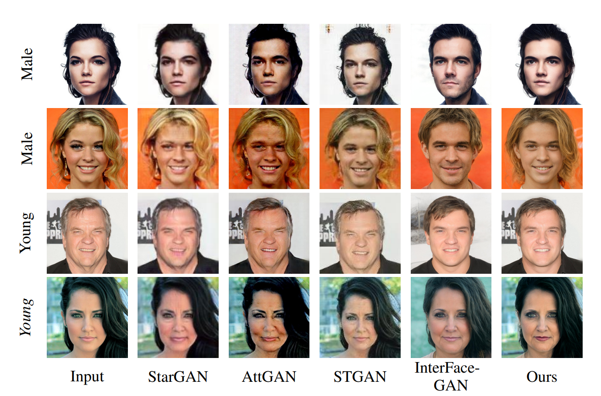
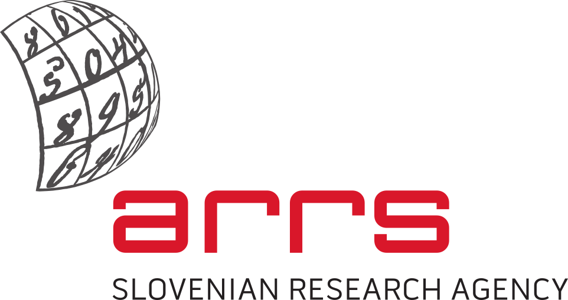

# High Resolution Face Editing with Masked GAN Latent Code Optimization 
## IEEE Transactions on Image Processing 2023

[PDF](https://arxiv.org/abs/2103.11135)

We propose a method for high resolution face editing through the use of constraints on GAN inpainted image regions.

### Abstract
Face editing represents a popular research topic within the computer vision and image processing communities. While significant progress has been made recently in this area, existing solutions: (i) are still largely focused on low-resolution images, (ii) often generate editing results with visual artefacts, or (iii) lack fine-grained control and alter multiple (entangled) attributes at once, when trying to generate the desired facial semantics. In this paper, we aim to address these issues though a novel attribute editing approach called MaskFaceGAN. The proposed approach is based on an optimization procedure that directly optimizes the latent code of a pre-trained (state-of-the-art) Generative Adversarial Network (i.e., StyleGAN2) with respect to several constraints that ensure: (i) preservation of relevant image content, (ii) generation of the targeted facial attributes, and (iii) spatially--selective treatment of local image areas. The constraints are enforced with the help of an (differentiable) attribute classifier and face parser that provide the necessary reference information for the optimization procedure. MaskFaceGAN is evaluated in extensive experiments on the CelebA-HQ, Helen and SiblingsDB-HQf datasets and in comparison with several state-of-the-art techniques from the literature, i.e., StarGAN, AttGAN, STGAN, and two versions of InterFaceGAN. Our experimental results show that the proposed approach is able to edit face images with respect to several facial attributes with unprecedented image quality and at high-resolutions (1024x1024), while exhibiting considerably less problems with attribute entanglement than competing solutions.

### Model Sketch

### Examples 
#### Comparison with Other Models

#### Attribute Size Manipulation

#### Attribute Intensity Manipulation

#### NEW: Global Editing 

Global editing is turned on my default whenever you run main.py with `attribute` argument that does not belong to the `local_attributes` list (specified in `config.yml`).

## Setup

### 1. Install requirements
pip install -r requirements.txt

### 2. Download pretrained models

#### StyleGAN2
Convert the official weights, by cloning and following instructions of 
[rosinality's PyTorch StyleGAN implementation ](https://github.com/rosinality/stylegan2-pytorch).
Copy the created `stylegan2-ffhq-config-f.pt` checkpoint to models/stylegan2 folder.

#### Other models (attribute classifier, face parser and e4e encoder)
Download the model checkpoint with download.sh script

`./download.sh`

#### 3. Run the program
`python main.py --attribute mouth_slightly_open --outdir output --image input/1815.jpg`

You can also optionally use the e4e model (it is downloaded via `download.sh` script). Use it by specifying
`--e4e_init` argument when calling the `main.py` script.

The available attributes are specified in `config.yml`

###  Code acknowledgements
StyleGAN2 code is based on the [rosinality's PyTorch implementation](https://github.com/rosinality/stylegan2-pytorch).

The e4e code is based on the [official implementation](https://github.com/omertov/encoder4editing)

Masked LPIPS loss function is adapted from [official implementation](https://github.com/richzhang/PerceptualSimilarity)

### Sponsor acknowledgements
Supported in parts by the Slovenian Research Agency ARRS through the Research Programme P2-0250(B) Metrology and Biometric System, the ARRS Project J2-2501(A) DeepBeauty and the ARRS junior researcher program.

### Citation

If you find MaskFaceGAN useful in your research work, please consider citing:

    @ARTICLE{DBLP:journals/corr/abs-2103-11135,
      author    = {Martin Pernus and
                   Vitomir Struc and
                   Simon Dobrisek},
      title     = {High Resolution Face Editing with Masked {GAN} Latent Code Optimization},
      journal   = {CoRR},
      volume    = {abs/2103.11135},
      year      = {2021},
      url       = {https://arxiv.org/abs/2103.11135},
      eprinttype = {arXiv},
      eprint    = {2103.11135},
      timestamp = {Wed, 24 Mar 2021 15:50:40 +0100},
      biburl    = {https://dblp.org/rec/journals/corr/abs-2103-11135.bib},
      bibsource = {dblp computer science bibliography, https://dblp.org}
    }
    

